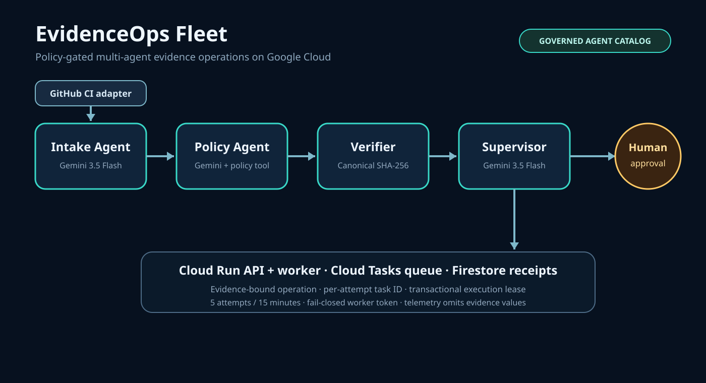
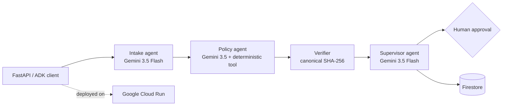

# EvidenceOps Fleet

EvidenceOps Fleet is a policy-gated multi-agent system for the people who must
prove that a release, application, or audit package is complete before an
irreversible external action. It is a new project created during the All Things
Agentic Hackathon submission period for the **Fortified Enterprise Fleet** track.

## The unlikely hero

Small release and compliance teams carry enterprise-grade risk without an
enterprise operations staff. Evidence arrives from issue trackers, CI, storage,
and human reviewers. A missing test receipt or conflicting commit can turn a
routine publication into a costly incident.

EvidenceOps Fleet delegates the work to specialized agents:





The model may summarize and route, but it cannot turn missing evidence into a
pass. Deterministic checks identify missing fields and source-visible conflicts;
the verifier binds the result to a canonical digest; the supervisor fails closed
before publication, signing, payment, or any other bounded external action.
Ready cases can then receive an idempotent human approval receipt. The actor label
and note are hashed immediately; only digests and the evidence-bound receipt are stored.
Without `EVIDENCEOPS_APPROVAL_TOKEN`, only synthetic `demo-*` cases can use the
console approval button. Real approvals require the token in `X-Approval-Token`;
production deployments should inject it from Secret Manager and place the service
behind IAM or an authenticated gateway.

## Required Google stack

- Gemini model: `gemini-3.5-flash`
- Agent framework: Google Agent Development Kit (`google-adk`)
- Cloud infrastructure: Cloud Run and Firestore

The ADK definition is in `evidenceops_fleet/agent.py`. The reproducible HTTP
control plane is in `evidenceops_fleet/main.py`. `POST /cases/{case_id}/brief`
runs a real graph-based ADK `Workflow` and gives Gemini only the persisted result,
never the original evidence values. Tests use a fake runner and do not claim model
or cloud execution. Every returned brief repeats the authoritative source decision
and evidence digest; generated prose is advisory and cannot mutate the case.

## Run locally

```bash
python -m venv .venv
.venv/bin/pip install -e '.[test]'
.venv/bin/pytest -q
.venv/bin/uvicorn evidenceops_fleet.main:app --reload
```

Open `http://localhost:8000/` for the interactive three-scenario review console,
or `http://localhost:8000/docs` for the API. Local runs use an explicitly in-memory store.
To run the Gemini-backed ADK fleet, set `GOOGLE_API_KEY` and use ADK's local
runner against the `evidenceops_fleet` package.

Exercise the deterministic control plane:

```bash
curl -sS http://localhost:8000/cases \
  -H 'content-type: application/json' \
  --data @examples/release-case.json | python -m json.tool
```

## Deploy to Google Cloud

Create a dedicated project with billing safeguards. Pre-create three Secret
Manager secrets (`gemini-api-key`, `approval-token`, and `brief-token`) without
placing their payloads in shell history or this repository. Then review the
deployment plan and deploy:

```bash
scripts/deploy_google_cloud.sh YOUR_PROJECT_ID --plan
scripts/deploy_google_cloud.sh YOUR_PROJECT_ID
```

The script creates a dedicated runtime service account, grants only datastore
user plus per-secret access, and grants the active deployer Service Account User
only on that dedicated identity as required to attach it to Cloud Run. It caps
Cloud Run at two instances, labels the revision with the clean Git commit, and
leaves public Gemini demo mode disabled. It never reads or prints secret
payloads. Do not place API keys, service-account JSON, cookies, or private
evidence in the repository.
Paid Gemini brief calls require `X-Brief-Token`; the dashboard asks for the
temporary token and does not persist it. For a time-bounded public judging demo,
`EVIDENCEOPS_PUBLIC_DEMO_BRIEFS=true` explicitly permits only synthetic
`demo-*` cases. Disable that flag after judging to prevent unbounded model cost.
The first successful brief is stored against the immutable case ID and evidence
digest; subsequent authorized retries return that receipt without another model
call.

After deployment, independently replay the public paths before making any cloud
or model-execution claim:

```bash
EVIDENCEOPS_BRIEF_TOKEN='READ_FROM_SECRET_MANAGER' \
python scripts/verify_public_deployment.py \
  https://YOUR-SERVICE-URL --require-gemini \
  --source-commit "$(git rev-parse HEAD)" --output deployment-receipt.json
```

Submission preparation lives in [SUBMISSION_DRAFT.md](SUBMISSION_DRAFT.md), the
under-four-minute recording plan in [DEMO_SCRIPT.md](DEMO_SCRIPT.md), and the
claim gate in [CLOUD_EVIDENCE.md](CLOUD_EVIDENCE.md). The ordered screenshot and
architecture captions are in [MEDIA.md](MEDIA.md). [TRACK_FIT.md](TRACK_FIT.md)
keeps the selected category bounded by current implementation evidence.

## Claims boundary

- The repository does not yet claim a live Google Cloud deployment.
- Synthetic examples are not customer data or evidence of revenue.
- The deterministic API demonstrates the control plane; ADK/Gemini execution
  requires a configured key and is never simulated in test receipts.
- This repository was created during the contest period. No code was copied
  from the earlier Opportunity Memory Agent project; only the entrant's general
  experience with evidence-gated workflows informed the problem selection.

## License

MIT
