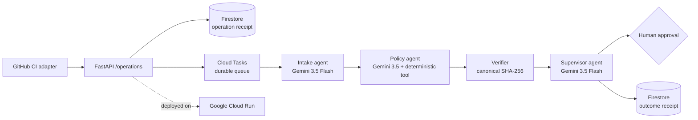

# EvidenceOps Fleet

EvidenceOps Fleet is an autonomous GitHub-to-approval control plane for the tiny
release and compliance teams that carry enterprise-sized risk. It collects an
observed commit and CI state, applies deterministic vetoes, and binds human
approval to a durable digest without persisting raw evidence. It is a new project
created during the All Things Agentic Hackathon submission period for the
**Fortified Enterprise Fleet** track.

## The unlikely hero

Small release and compliance teams carry enterprise-grade risk without an
enterprise operations staff. Evidence arrives from issue trackers, CI, storage,
and human reviewers. A missing test receipt or conflicting commit can turn a
routine publication into a costly incident.

EvidenceOps Fleet delegates the work to specialized agents:

`GET /agents` is a governed cross-department catalog, not only a name list. Each
registration publishes version and lifecycle, owning department, approved
consumer departments, capabilities, input boundary, data classifications, and
allowed region. Judges can discover approved agents with `department` and
`capability` filters without exposing credentials or runtime state.

`GET /workflow` discloses the actual delegation graph: three Google ADK LLM
agents produce a redacted post-decision brief, while the deterministic verifier
remains outside model authority and owns the decision and evidence digest.




The API first binds each request to an immutable operation digest, then uses a
deterministic per-attempt Cloud Tasks ID so dispatch can be retried without
duplicating one attempt, while a failed operation can advance to a new task ID.
A transactional five-minute execution lease prevents
overlapping at-least-once deliveries while allowing a crashed worker to be
reclaimed safely. The model may summarize and route, but it cannot turn missing evidence into a
pass. Deterministic checks identify missing fields and source-visible conflicts;
the verifier binds the result to a canonical digest; the supervisor fails closed
before publication, signing, payment, or any other bounded external action.
Ready cases can then receive an idempotent human approval receipt. The actor label
and note are hashed immediately; only digests and the evidence-bound receipt are stored.
Without `EVIDENCEOPS_APPROVAL_TOKEN`, only synthetic `demo-*` cases can use the
console approval button. Real approvals require the token in `X-Approval-Token`;
production deployments should inject it from Secret Manager and place the service
behind IAM or an authenticated gateway.

## Required Google stack

- Gemini model: `gemini-3.5-flash`
- Agent framework: Google Agent Development Kit (`google-adk`)
- Cloud infrastructure: Cloud Run and Firestore

The ADK definition is in `evidenceops_fleet/agent.py`. The reproducible HTTP
control plane is in `evidenceops_fleet/main.py`. `POST /cases/{case_id}/brief`
runs a real graph-based ADK `Workflow` and gives Gemini only the persisted result,
never the original evidence values. Tests use a fake runner and do not claim model
or cloud execution. Every returned brief repeats the authoritative source decision
and evidence digest; generated prose is advisory and cannot mutate the case.

`POST /operations` adds a durable asynchronous path. In Google Cloud it writes
an evidence-bound operation receipt to Firestore and dispatches a deterministic,
idempotent Cloud Tasks job. The private worker validates a Secret Manager-backed
task token whenever that secret is configured—even before queue configuration
is complete—and validates the original input digest before execution. Local runs use
FastAPI background tasks while preserving the same operation contract.
Firestore mode never silently falls back to an in-process background task: if
Cloud Tasks configuration is incomplete, operation creation returns `503`
before persisting anything and `/runtime` reports `misconfigured`.

`POST /integrations/github/operations` removes manual CI evidence copying. A
fixed-host adapter reads one validated `owner/repository` commit and its GitHub
check runs, emits only the observed SHA, successful-check summary, and source
URLs, then enters the same durable operation contract. Any absent, pending, or
failed check omits the required `tests` evidence so policy blocks the case.
`EVIDENCEOPS_GITHUB_TOKEN` is optional for higher API limits or private repos;
its value is never persisted or returned.
The deployment reconciles the queue to five attempts within a 15-minute retry
window, with bounded exponential backoff and two concurrent dispatches. This
prevents an unavailable worker from creating an open-ended cost or retry loop.

## Run locally

```bash
python -m venv .venv
.venv/bin/pip install -e '.[test]'
.venv/bin/pytest -q
.venv/bin/uvicorn evidenceops_fleet.main:app --reload
```

Open `http://localhost:8000/` for the interactive three-scenario review console,
or `http://localhost:8000/docs` for the API. Local runs use an explicitly in-memory store.
To run the Gemini-backed ADK fleet, set `GOOGLE_API_KEY` and use ADK's local
runner against the `evidenceops_fleet` package.

Exercise the deterministic control plane:

```bash
curl -sS http://localhost:8000/cases \
  -H 'content-type: application/json' \
  --data @examples/release-case.json | python -m json.tool
```

## Deploy to Google Cloud

Create a dedicated project with billing safeguards. Pre-create four Secret
Manager secrets (`gemini-api-key`, `approval-token`, `brief-token`, and
`task-token`) without
placing their payloads in shell history or this repository. First run the
read-only preflight, then review the deployment plan and deploy:

```bash
python scripts/preflight_google_cloud.py YOUR_PROJECT_ID \
  --output cloud-preflight.json
scripts/deploy_google_cloud.sh YOUR_PROJECT_ID --plan
scripts/deploy_google_cloud.sh YOUR_PROJECT_ID
```

The preflight checks the CLI, active identity, project access, billing, and
secret names without enabling services, creating resources, reading secret
payloads, or printing the active account. API enablement is reported separately
because the deployment script performs that step.

The script creates a dedicated runtime service account and a rate-limited Cloud
Tasks queue, grants only datastore user, task enqueuer, and per-secret access,
and grants the active deployer Service Account User
only on that dedicated identity as required to attach it to Cloud Run. It caps
Cloud Run at two instances, labels the revision with the clean Git commit, and
leaves public Gemini demo mode disabled. It never reads or prints secret
payloads. Do not place API keys, service-account JSON, cookies, or private
evidence in the repository.
Paid Gemini brief calls require `X-Brief-Token`; the dashboard asks for the
temporary token and does not persist it. For a time-bounded public judging demo,
`EVIDENCEOPS_PUBLIC_DEMO_BRIEFS=true` explicitly permits only synthetic
`demo-*` cases. Disable that flag after judging to prevent unbounded model cost.
The first successful brief is stored against the immutable case ID and evidence
digest; subsequent authorized retries return that receipt without another model
call.

`GET /cases/{case_id}/memory` reconstructs a deterministic cross-session context
snapshot from the case, latest durable operation, approval receipts, and cached
brief. Events contain only IDs, timestamps, statuses, and digests; raw evidence,
reviewer labels, and notes are excluded. Firestore deployments configure no TTL,
so the snapshot remains available across weeks until an operator intentionally
adds a retention policy. `retention_policy=no-ttl-configured` is disclosure, not
a promise that data can never be deleted.

After deployment, independently replay the public paths before making any cloud
or model-execution claim. The verifier also checks the redacted cross-session
memory snapshot and writes it into the local deployment receipt:

```bash
EVIDENCEOPS_BRIEF_TOKEN='READ_FROM_SECRET_MANAGER' \
python scripts/verify_public_deployment.py \
  https://YOUR-SERVICE-URL --require-gemini \
  --source-commit "$(git rev-parse HEAD)" \
  --github-repository ILoveBuns/evidenceops-fleet \
  --github-commit "$(git rev-parse HEAD)" \
  --output deployment-receipt.json
```

Before submission, run the fail-closed checklist:

```bash
python scripts/audit_submission_readiness.py \
  --output submission-readiness.json
```

It exits nonzero until the public video URL, observed Google Cloud receipt, and
clean source commit matching `origin/main` are all present. The JSON output is a
gate report, not evidence that a missing external step was completed. It also
reports optional contribution readiness separately; missing bonus items never
hide or replace a required submission blocker. Publication-ready article and
social drafts live in [BONUS_DRAFTS.md](BONUS_DRAFTS.md).

Submission preparation lives in [SUBMISSION_DRAFT.md](SUBMISSION_DRAFT.md), the
under-four-minute recording plan in [DEMO_SCRIPT.md](DEMO_SCRIPT.md), and the
claim gate in [CLOUD_EVIDENCE.md](CLOUD_EVIDENCE.md). The ordered screenshot and
architecture captions are in [MEDIA.md](MEDIA.md). [TRACK_FIT.md](TRACK_FIT.md)
keeps the selected category bounded by current implementation evidence.

## Claims boundary

- The repository does not yet claim a live Google Cloud deployment.
- Synthetic examples are not customer data or evidence of revenue.
- The deterministic API demonstrates the control plane; ADK/Gemini execution
  requires a configured key and is never simulated in test receipts.
- This repository was created during the contest period. No code was copied
  from the earlier Opportunity Memory Agent project; only the entrant's general
  experience with evidence-gated workflows informed the problem selection.

## License

MIT
